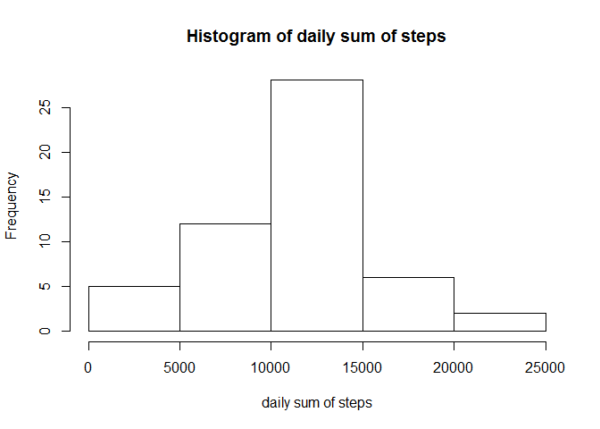
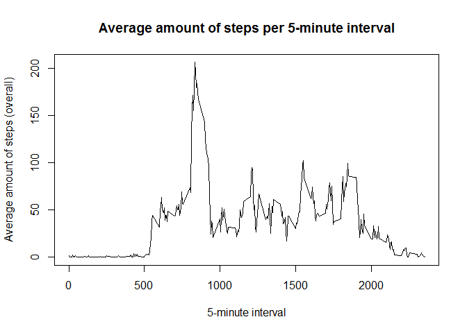
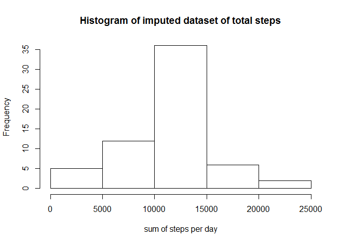
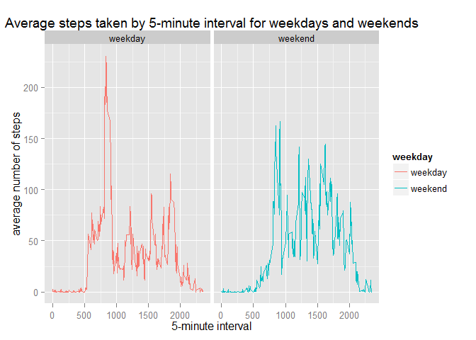

# Reproducible Research: Peer Assessment 1


## Loading and preprocessing the data

```r
unzip('activity.zip', list = FALSE, overwrite = TRUE)
activity.raw <- read.csv('activity.csv')
```

Since the Date Variable is actually imported as a factor we had to convert it 
to date.


```r
activity.raw$date <- as.Date(activity.raw$date, "%Y-%m-%d")
```

## What is mean total number of steps taken per day?
First of to answer this question we have to omit the NA-Values, after that we can calculate the sum of steps per day.
Also we calculate the median and mean of the steps per day, because it is asked
in the second question.


```r
# Removing NAs
activity.wona <- activity.raw[complete.cases(activity.raw), ]

# summarize the data
library(dplyr)
```

```
## Warning: package 'dplyr' was built under R version 3.1.1
```

```
## 
## Attaching package: 'dplyr'
## 
## Das folgende Objekt ist maskiert from 'package:stats':
## 
##     filter
## 
## Die folgenden Objekte sind maskiert from 'package:base':
## 
##     intersect, setdiff, setequal, union
```

```r
activity.grpd <- group_by(activity.wona, date)
activity.daily <- summarise(activity.grpd,
  sum_of_steps = sum(steps, na.rm = TRUE),
  mean = mean(steps, na.rm = TRUE),
  median = median(steps, na.rm = TRUE))
```

After we got that data we need, we plot it in a historgram


```r
hist(activity.daily$sum_of_steps, 
     main="Histogram of daily sum of steps",
     xlab="daily sum of steps")
```

 

Now we can calculate the statistics on that question:

```r
unimputed_mean <- mean(activity.daily$sum_of_steps)
unimputed_median <- median(activity.daily$sum_of_steps)
```
The mean of sum of steps is 1.0766189\times 10^{4}and the median is 10765.

## What is the average daily activity pattern?
For this question we have to go back to our dataset without NAs and group it 
again by 5-minute interval.


```r
library(dplyr)
activity.grpd.int <- group_by(activity.wona, interval)
activity.int <- summarise(activity.grpd.int,
  avg_of_steps = sum(steps, na.rm = TRUE) / n())
```

Now we can make the plot with the already finished dataset which you can see here:


```r
plot(activity.int$avg_of_steps ~ activity.int$interval, 
    type = "l",
    main = "Average amount of steps per 5-minute interval",
    xlab = "5-minute interval",
    ylab = 'Average amount of steps (overall)')
```

 


## Imputing missing values
1. How many NA values are there in the raw dataset?

```r
number_of_NA <- sum(!complete.cases(activity.raw))
```
There are 2304NA values in the dataset.

2. Which strategy for imputing the NAs will be used?
I will use the mean for the 5-minute-interval for imputing missing values.

3. Create a dataset based on the original dataset where the missing data is 
imputed.


```r
# make a LEFT OUTER JOIN to move the averages to the right side of the original
# dataframe
activity.merged <- merge(activity.raw, activity.int, by="interval", all.x=TRUE)

# now overwrite the NAs with the averages from the right side
activity.merged[is.na(activity.merged$steps), 2] <- activity.merged[is.na(activity.merged$steps), 4]
```

4. Based on 3 construct the grouped dataset for sum, mean and median of steps per day, plot a histogram and describe differences


```r
# summarize the data
activity.imp <- group_by(activity.merged, date)
activity.imp.daily <- summarise(activity.imp,
  sum_of_steps = sum(steps, na.rm = TRUE),
  mean = mean(steps, na.rm = TRUE),
  median = median(steps, na.rm = TRUE))
```
Since we now got our working dataset we can start plotting


```r
hist(activity.imp.daily$sum_of_steps,
     main = "Histogram of imputed dataset of total steps",
     xlab = "sum of steps per day",)
```

 

For comparing the different means and medians of steps per day, I will create
a plot, where you can compare the different lines in the plot

Now we can calculate the statistics on that question:

```r
imputed_mean <- mean(activity.imp.daily$sum_of_steps)
imputed_median <- median(activity.imp.daily$sum_of_steps)
```
The mean of sum of steps is 1.0766189\times 10^{4}and the median is 1.0766189\times 10^{4}.

When we compare the means and medians of the imputed and unimputed data we can not see much difference.
The numbers are pretty much the same. But when we compare the Histograms of the data we can see a constant 
higher frequency of about 10 of sum of steps.


## Are there differences in activity patterns between weekdays and weekends?

1. Create a new Variable which indicates if a day was a weekend or weekday.


```r
# set the given day
activity.merged$wd <- weekdays(activity.merged$date)

# set everything to weekday
activity.merged$weekday <- "weekday"

# overwrite everything which is weekend with "weekend"
activity.merged[activity.merged$wd %in% c("Samstag", "Sonntag"), ]$weekday <- "weekend"
```

2. Create a plot with 5-minute interval against the average steps by weekend or weekday

To answer this question we firstly have to construct the aggregated dataset:


```r
activity.week <- group_by(activity.merged, weekday, interval)
activity.week.int <- summarise(activity.week,
  avg_of_steps = sum(steps, na.rm = TRUE) / n())
```

Now we can start to make the comparing plot with the facets set to weekday:


```r
library(ggplot2)
ggplot(data=activity.week.int, aes(x=interval, y = avg_of_steps, colour = weekday, group = weekday)) + geom_line()  + facet_wrap(~weekday) +ggtitle("Average steps taken by 5-minute interval for weekdays and weekends") + xlab("5-minute interval") +
    ylab("average number of steps")
```

 

You can clearly see more steps in earlier time intervals in the left plot when
there is a weekday. And more steps in the middle of the day when there is a weekend.
